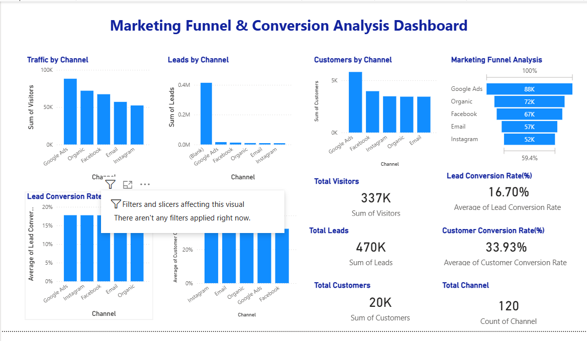

# 📊 Marketing Funnel & Conversion Analysis Dashboard

## 📌 Overview

This project presents a **Marketing Funnel & Conversion Analysis Dashboard** built using **Power BI**.
It provides insights into how users move through different stages of the marketing funnel — from **Visitors → Leads → Customers**, and helps identify performance across different channels.

---

## 🎯 Objectives

* Analyze user behavior across the marketing funnel
* Measure **conversion rates** at each stage
* Compare **channel performance**
* Identify drop-offs and improvement areas

---

## 📂 Dataset

The dataset includes the following key fields:

* **Channel** – Source of traffic (e.g., Social Media, Email, Ads)
* **Visitors** – Number of users visiting
* **Leads** – Users showing interest
* **Customers** – Final conversions

---

## 📊 Dashboard Features

### 🔹 Visualizations Used

* **Clustered Column Charts**

  * Traffic by Channel
  * Leads by Channel
  * Customers by Channel

* **Funnel Chart**

  * Visualizes drop-off across funnel stages

* **Conversion Rate Charts**

  * Lead Conversion Rate by Channel
  * Customer Conversion Rate by Channel

* **Cards (KPIs)**

  * Total Visitors
  * Total Leads
  * Total Customers
  * Lead Conversion Rate (%)
  * Customer Conversion Rate (%)
  * Total Channels

---

## 📈 Key Metrics

* **Lead Conversion Rate**
  = Leads / Visitors

* **Customer Conversion Rate**
  = Customers / Leads

---

## 🔍 Insights

* Significant drop observed from **Visitors to Leads**
* Certain channels bring **high traffic but low conversions**
* Some channels perform better in **final customer conversion**
* Funnel inefficiencies highlight areas for optimization

---

## 🚀 Recommendations

* Improve **landing page design & CTA**
* Focus on **high-performing channels**
* Optimize **lead nurturing strategies**
* Reduce friction in **final conversion stage**
* Use **A/B testing** for better engagement

---

## 🖼️ Dashboard Preview

---

## 🛠️ Tools Used

* **Power BI** – Dashboard creation
* **Microsoft Excel** – Data preprocessing

---

## 📌 Conclusion

This dashboard helps in understanding **customer journey behavior**, identifying **conversion bottlenecks**, and making **data-driven marketing decisions** to improve overall performance.
